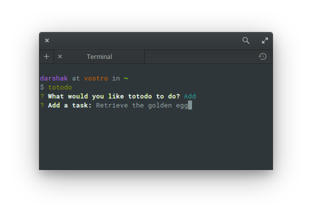

# totodo

> totodo is a barebones, no-nonsense todo list for your command line.

[](https://travis-ci.org/dar5hak/totodo)
[](https://www.npmjs.com/package/totodo)
[](http://standardjs.com/)
[](http://github.com/syl20bnr/spacemacs)

## Installation

```sh
npm install -g totodo
```

## Usage

```sh
totodo
```

## Screenshots





## License

MIT &copy; [Darshak Parikh](https://github.com/dar5hak)
